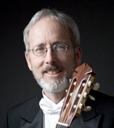

For the last three decades, Paul has been an active member of San Francisco’s musical community, playing music in all sorts of situations. Paul has performed as an ensemble player with the San Francisco Symphony, San Francisco Contemporary Music Players, the San Francisco Opera and Ballet Orchestras, the Los Angeles Opera Orchestra and many other groups in music ranging from baroque opera to modern chamber music.

At the same time, Paul has built a local reputation as a jazz artist of taste and versatility.

Also a proficient mandolinist, Paul is a founding member of the Modern Mandolin Quartet which has done concert tours in the US and Europe and recorded four CD’s for Windham Hill Records and two for Dorian Sono Luminus.

These three areas of expertise (classical guitar, jazz guitar and mandolin) make Paul a musician in demand.  A favorite activity is playing as a freelance musician either solo or with friends, often at the wineries in the Napa Valley or at the hotels in downtown San Francisco.

As a teacher, Paul works at the San Francisco Conservatory of Music Preparatory Department, at The Hamlin School and at his own studio.

Recording credits include the San Francisco Symphony recordings of Prokofiev’s 'Romeo and Juliet' (mandolin) and Mahler’s Seventh Symphony (guitar) under the baton of Michael Tilson Thomas.

Paul began his classical guitar studies in London, Ontario where he gave his first professional concerts before graduating from high school. Paul then spent two years studying jazz guitar at Berklee College of Music in Boston, which led to several years of playing with jazz and rock bands while teaching classical guitar during the day.

Paul then moved to San Francisco to complete his Bachelor of Music degree at the San Francisco Conservatory of Music and his Master of Arts in Music at San Francisco State University, majoring in classical guitar performance.

