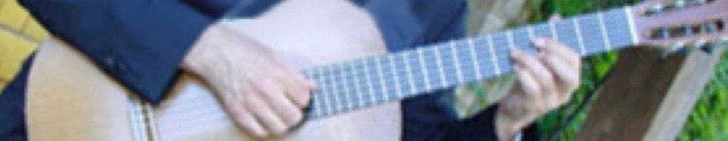
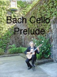
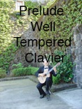
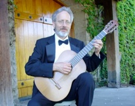
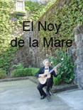
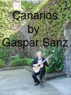
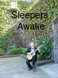

[Home](Home.html "Home.html") [Bio](Biography.html "Biography.html") [Classical Guitar](Classical_Guitar.html "") [Jazz Guitar](Jazz_Guitar.html "Jazz_Guitar.html") [Mandolin](Mandolin.html "Mandolin.html") [Lessons](Lessons.html "Lessons.html") [Ensembles](Ensembles.html "Ensembles.html") [Contact](Contact.html "Contact.html")

Classical Guitar

1. -Renaissance

2. -Baroque

3. -Classical

4. -Spanish

5. -South American

Classical Guitar

Paul’s main influences for classical guitar are Julian Bream and Andrés Segovia.  He regularly performs baroque, classical, Renaissance and Spanish guitar music at events in the San Francisco Bay Area and Napa Valley.

His instructors included Phillip Roshegar, George Sakellariou, Bruce French, and David Tannenbaum.  He also performed at master classes of Leo Brouwer, Alexander Lagoya, Michael Lorimer, David Russel, Frederick Hand and many others.

To hear samples of Paul’s classical guitar playing, please click the buttons below.

Sample Repertoire List

Renaissance and Baroque

Bach: Cello Suite No. 1 in D, Lute Suite No. 4 in E Major

Chilesotti: Six Lute Pieces of the Renaissance

Dowland: Allemande, Queen Elizabeth's Galliard

Narvaez: Guardame las Vacas

Sanz: Canarios

Milan: Five Pavans

Vivaldi: Concerto in D Major

Scarlatti: Sonata in A Major

Spanish

Albeniz: Granada, Leyenda, Cadiz

Sor: Minuet and Rondo

Granados: Spanish Dance No. 5

Llobet: Catalonian Folk Songs

Tarrega: Caprichio Arabe, Recuerdos de la Alhambra, Adelita, Lagrima, Las Dos Hermanitas

Torroba: Madronos, Sonatina

Anonymous: Romanza, Linda, Celeste y Blanco

Lecuona: Malaguena

Malats: Serenata Espanola

South American

Villa-Lobos: Five Preludes, Choros #1

Lauro: Four Venezuelan Waltzes, Maria Luisa

Pernambuco: Sons de Carilhoes, Po de Mico

Brouwer: Berceuse (Afro-Cuban Lullaby)

Barrios: Ultimo Cancion

Jose Ferrer: Vals Español

