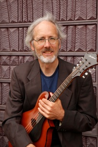
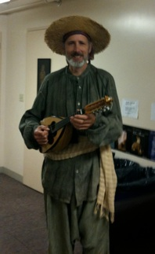
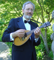

[Home](Home.html "Home.html") [Bio](Biography.html "Biography.html") [Classical Guitar](Classical_Guitar.html "Classical_Guitar.html") [Jazz Guitar](Jazz_Guitar.html "Jazz_Guitar.html") [Mandolin](Mandolin.html "") [Lessons](Lessons.html "Lessons.html") [Ensembles](Ensembles.html "Ensembles.html") [Contact](Contact.html "Contact.html")

Mandolin

1. -Classical

2. -Italian Traditional

Mandolin

Paul learned to play the mandolin when he was asked to play in George Crumb’s Ancient Voices of Children as a graduate student at San Francisco State University.  He went on to play mandolin parts with the San Francisco Symphony, Opera and Ballet, the Modern Mandolin Quartet, and with Dawn Upshaw and the San Francisco Contemporary Music Players doing the same George Crumb piece he started with.

He is also a founding member of the Modern Mandolin Quartet, which has recorded 6 CD’s and toured nationwide and in Europe.

Paul performs classical music as well as Italian standards on the mandolin.

Paul in costume for onstage role with San Francisco Opera as peasant musician in Verdi’s Otello.

